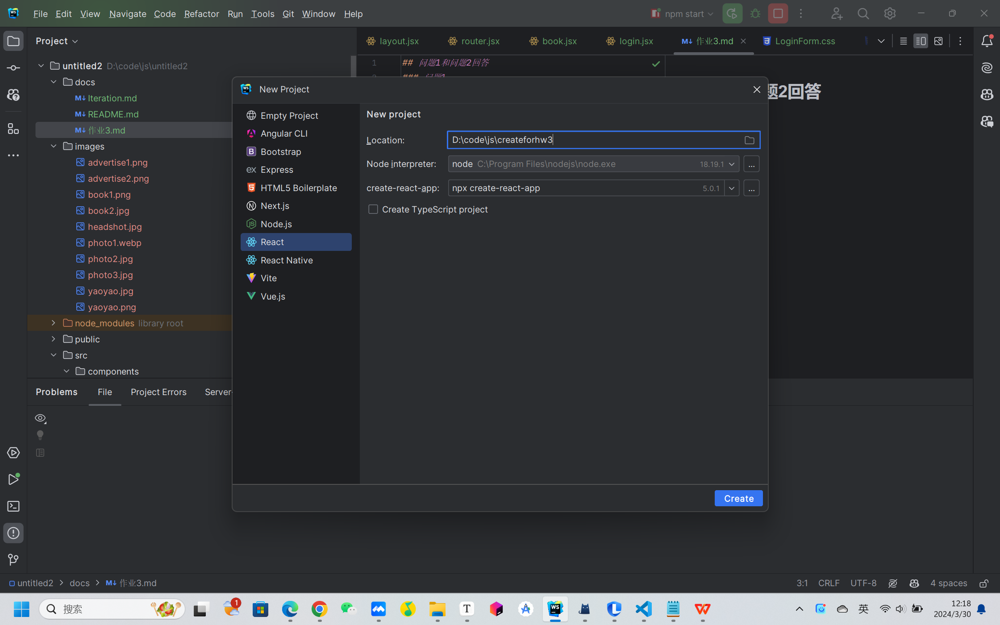
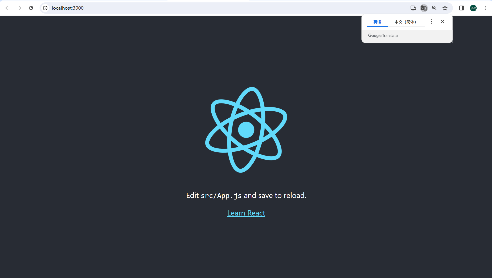

## 问题1和问题2回答
### 问题1
#### 创建过程

#### 运行结果

#### 适当说明
​	完成node.js的完整环境配置后，将npm的源换为腾讯源，在命令行中输入指令npm install，然后就可以直接在webstorm中new里面创建react的项目。创建完毕后使用npm start命令或者点击右上角的运行按钮即可以运行程序。

### 问题2的回答

#### 主页面需要的component

- bookInfoCard
  - 用于在主页面的book一栏中实现书籍图片、名称、价格、作者等信息的一体化显示
- layout
  - 用于规范页面的框架文档，比如侧边栏、顶部栏等等内容
- navbar
  - 将侧边栏封装成组件
- bookAdvertise
  - 用于在主页面的book一栏的serach栏下方，书籍图片栏上方放置一些实时较热的书籍广告，并支持滑动查看
- bookInfoList
  - 将bookInfoCard用列表的形式列在主页面上
- 

#### 需要的view

- 顶部栏
  - 放置用户的个人信息，书店名以及图标等等
- 侧边栏
  - 提供书店的不同功能，可以通过侧边栏完成一系列操作如了解信息、购买书籍等等功能
- 搜索栏
  - 可以通过搜索栏直接检索自己想要的书籍信息
- 书籍广告
  - 页面的靠上方会有当下热点书籍的广告栏（且可滑动查看多条）
- 书籍简要信息
  - 页面的主体部分，以列表的形式展示书店中所有的书籍

#### 需要的service

- login.js
  - 登录并检查用户名、密码是否正确，正确则跳转到主页面进行书店浏览
- book.js
  - 在点击主页面的书籍简要信息和书籍广告时，会自动跳转到对应的详细介绍页面
- cart.js
  - 在购物车页面，对于下单、加入购物车等操作进行处理
- user.js
  - 在profile界面，允许user对于自己的头像、昵称、密码等进行修改
  - 也允许用户直接点击主页面右上角的头像进入profile
- logout.js
  - 在profile界面，允许user进行登出操作，返回到等待登录界面